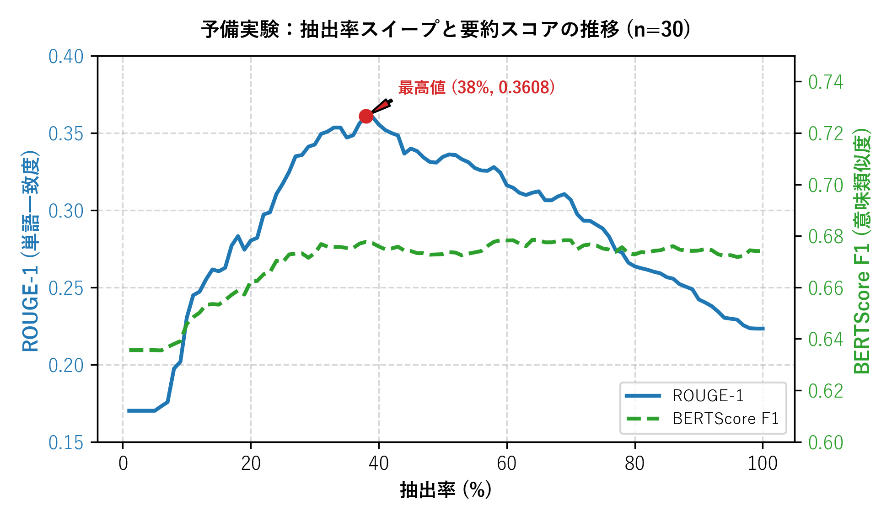
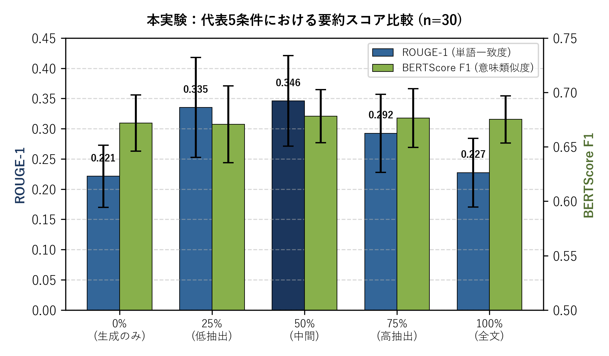
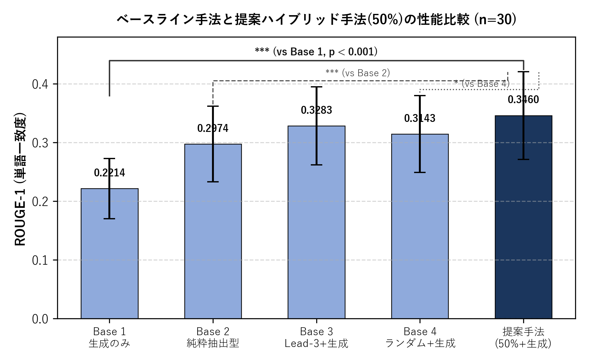

# 抽出率スイープを用いたハイブリッド自動要約における要約品質の変化と有効抽出率域の検証

> **二段階実験デザイン（探索的スイープ＆確認的本実験）によるローカル言語モデル要約品質の検証**

[](https://www.python.org/downloads/)
[](https://opensource.org/licenses/MIT)

本リポジトリは、JSEC2026応募論文「抽出率スイープを用いたハイブリッド自動要約における要約品質の変化と有効抽出率域の検証」の実験コード・データ・図表を公開するものです。**論文本体（PDF/docx）の記述が正、本READMEは論文と数値・方法が一致するように記載しています。**

***

## 📌 研究概要

クラウドの大規模言語モデル（LLM）が利用困難な制約環境（個人情報保護、災害時オフライン、車載・端末組込のリアルタイム処理、APIランニングコストゼロ要求など）において、ローカルで稼働する軽量事前学習済みモデル（BART）の実用化が求められています。

本研究では、全文を直接入力する対照条件（0%条件）に対し、前処理として抽出型要約（**文字バイグラムTF-IDF + 文位置ボーナス + MMR (Maximal Marginal Relevance)**）を施してから生成モデル（BART）に入力する**ハイブリッド要約手法**を提案し、抽出率（原文に対する採択文数の比）を変化させたときに要約品質がどう変化するかを検証しました。

事後的な最大値選択によるバイアスを避けるため、以下の**二段階実験デザイン**を用いています：

1. **第1段階：探索的予備実験（n=30, 1%〜100% 1%刻みの連続スイープ）**
   抽出率と評価スコアの関係を記述的に把握し、後続の検証で用いる代表条件を選定
2. **第2段階：確認的本実験（予備実験と重複しない独立サンプル n=30, 代表5条件：0%／25%／50%／75%／100%）**
   反復測定一元配置分散分析（RM-ANOVA, Greenhouse–Geisser補正）で全体差を検定した上で、0%条件を基準とする**対応のあるt検定＋Bonferroni補正**により個別条件差を評価
   4つの対照ベースライン（生成のみ、純粋抽出型、Lead-3＋生成、ランダム抽出＋生成）との比較も同様の手順で実施

***

## 📊 主要な実験結果（論文の記述に対応）

### 1. 予備実験：抽出率スイープ推移 (n=30)

抽出率を1%〜100%まで変化させたときの評価スコアの推移です。BERTScore F1は抽出率によらずほぼ一定（約0.63〜0.68）でしたが、ROUGE-1（文字単位F1）は**抽出率38%で最大値0.3608**をとり、30〜60%付近で比較的高い値が続く山型の傾向を示しました（その後は低下）。

<p align="center">
  
</p>

### 2. 確認的本実験：代表5条件の比較（独立サンプル n=30）

予備実験と重複しない独立した30記事による確認実験において、**抽出率50%条件**（ROUGE-1 = 0.3460）は原文直接入力（0%条件、ROUGE-1 = 0.2214）に対して対応のあるt検定で有意に高い値を示しました（t(29) = 11.882, Bonferroni補正後 p < 0.001, Cohen's d = 2.17）。25%・75%条件も0%条件を有意に上回りましたが、50%条件と25%条件の差（0.0109）は小さく、本実験の5条件比較のみから50%を厳密な最適点と結論づけることはできません。

<p align="center">
  
</p>

### 3. ベースライン比較

4つの対照ベースラインとの比較（Bonferroni補正、4比較）により、提案手法（抽出率50%＋生成）はROUGE-1において生成のみ（Base 1）・純粋抽出型（Base 2）・ランダム抽出＋生成（Base 4）に対して有意に高い値を示しました。一方、Lead-3＋生成（Base 3）との差（+0.0177）は有意ではなく（補正後 p = 0.436）、本実験の範囲では提案手法がLead-3＋生成より優れるとは断定できません。またBERTScore F1では、Lead-3＋生成・ランダム抽出＋生成・純粋抽出型のいずれも提案手法をわずかに上回りました。

<p align="center">
  
</p>

***

## 📁 ディレクトリ構成

```text
.
├── .gitignore                         # Git除外設定（キャッシュ・一時ファイル・ローカル退避等）
├── README.md                          # 本ドキュメント
├── requirements.txt                   # 依存ライブラリ一覧
│
├── src/                               # 実行スクリプト
│   ├── experiment_pipeline.py         # 実験パイプライン（XL-Sum取得・要約生成・評価指標算出）
│   ├── analysis.py                    # 統計解析（RM-ANOVA, 対応のあるt検定+Bonferroni補正, 感度分析, 相関）
│   ├── generate_clean_charts.py       # 論文・README用グラフ描画 (fig1〜3)
│   ├── eval_llm_reference.py          # 参考値としてのクラウドLLM要約スコア算出（論文の主結果には含まない）
│   ├── measure_local_cpu_latency.py   # ローカルCPU環境での推論速度・メモリ実測（参考値）
│   └── build_paper_docx.py            # 提出用docxの体裁（見出し・表組み・書式）を組み立てる自動整形スクリプト。
│                                       # 本文・図表番号・数値は著者が作成・確定した原稿をコード内にテキストとして
│                                       # 記述したものであり、本スクリプト自体が文章や結論を生成するものではない。
│
├── data/                              # 実験結果データ
│   ├── aggregate/                     # 集約データ・ベースライン・MMR感度分析CSV
│   │   ├── hybrid_aggregate_*.csv
│   │   ├── baselines_detail_*.csv
│   │   └── sensitivity_detail_*.csv
│   ├── raw/                           # 全文・抽出率別の詳細評価CSV
│   │   └── hybrid_detail_*.csv
│   ├── llm_reference_results.json     # クラウドLLM参考値（論文の主結果には含まない）
│   └── analysis_result.txt            # 統計解析の全出力（RM-ANOVA・t検定・感度分析・相関）
│
└── figures/                           # 評価グラフ画像
    ├── fig1.png                       # スイープ推移グラフ
    ├── fig2.png                       # 代表5条件棒グラフ
    └── fig3.png                       # 4ベースライン比較棒グラフ
```

***

## 🚀 環境構築と再現手順

### 1. 依存ライブラリのインストール

```bash
pip install -r requirements.txt
```

### 2. 統計解析の実行

既存の実験CSVデータ群（`data/` 配下）を読み込み、RM-ANOVA、対応のあるt検定＋Bonferroni補正、ベースライン比較、感度分析、長さ交絡の検証を一括実行します。

```bash
python src/analysis.py
```

実行結果はコンソールに表示されるとともに、`data/analysis_result.txt` に出力されます。
※ `analysis.py` は頑健性の確認としてDunnettの多重比較検定（scipy未対応環境ではBonferroni近似）も同時に出力しますが、**論文本文で報告している検定手法は対応のあるt検定＋Bonferroni補正**です。数値はいずれの方法でも実質的に同じ結論になります。

### 3. グラフ・図表の再生成

論文および本READMEで使用している図1〜3を再生成します。

```bash
python src/generate_clean_charts.py
```

生成された画像は `figures/` ディレクトリに高解像度（300 dpi）で保存されます。

### 4. 提出用docxの体裁生成

著者が作成した本文・表・図をもとに、提出用フォーマット（A4・2段組）でdocxの体裁を組み立てます。文章そのものはスクリプト内に著者が記述したテキストとして保持されており、実行しても内容は変わりません。

```bash
python src/build_paper_docx.py
```

### 5. 実験パイプラインの再実行（オプション・GPU環境推奨）

XL-Sum Japanese データセットから記事を取得し、抽出率スイープ実験を新規に実行する場合：

```bash
python src/experiment_pipeline.py
```

※Google Colaboratory（T4 GPU等）での実行を推奨します。

***

## 🔬 実装技術と使用モデル

* **要約生成モデル**: `stockmark/bart-base-japanese-news`（事前学習済み軽量BART日本語モデル）
* **形態素解析**: `fugashi` + `unidic-lite`
* **抽出アルゴリズム**: 文字バイグラムTF-IDF (Salton & Buckley, 1988) + 文位置ボーナス + MMR (Carbonell & Goldstein, 1998)
* **論文で報告している評価指標**:
  * 表層語彙一致度: ROUGE-1 / ROUGE-2 / ROUGE-L（文字単位F1、`rouge_score`）
  * 意味的類似度: BERTScore F1 (`cl-tohoku/bert-base-japanese-v2`, lang=ja)
* **統計検定**: Mauchly球面性検定、反復測定一元配置分散分析（RM-ANOVA, Greenhouse-Geisser補正）、対応のあるt検定、Bonferroni補正
* **コードにのみ含む補助・参考データ**（論文の主結果表には未掲載）:
  * キーワード内容語保持率（fugashi による名詞・動詞・形容詞抽出ベースの簡易指標）
  * Dunnettの多重比較検定（頑健性確認用）
  * クラウドLLM参照スコア、ローカルCPU推論速度・メモリ実測

***

## 🤖 本研究における生成AIの利用について

JSEC応募規定に基づき、生成AIの利用範囲を明記します（応募フォームにも同内容を記載）。

* **研究対象としてのモデル利用**：本研究はハイブリッド自動要約の抽出前処理の効果を検証するものであり、要約文生成部に事前学習済み言語モデル（BART, `stockmark/bart-base-japanese-news`）を構成要素として組み込んでいます。これは研究の目的物としてのモデル利用であり、本項の「生成AI利用」（下記）とは区別されます。
* **コーディングの学習支援**：実験・解析・図表生成のPythonコード作成にあたり、Pythonライブラリの仕様理解や関数の基礎的・応用的な使い方を学ぶ目的で、生成AI（Claude、Gemini有料版）を学習支援ツールとして利用しました。実験設計、統計手法の選択、結果の解釈、結論は著者本人が行っています。
* **文章表現の校正支援**：論文本文のうち、一部の文章（考察等）について、校正・言い回しの提案の目的でのみ生成AIを利用しました。文章の内容・構成・結論は著者本人が作成・決定しています。
* 上記以外の研究の着想、実験の実施、データの収集・分析、結論の導出は著者本人によるものです。

***

## 📄 参照コード・データ

論文本文中の参照コミット：`2d3f54f44bbac1029507643fc88500653d654aad`

## 📚 参考文献

論文本文の参考文献一覧を参照してください。
